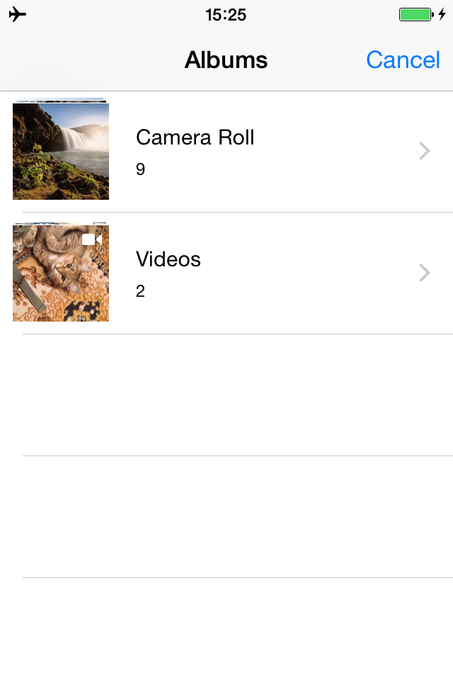
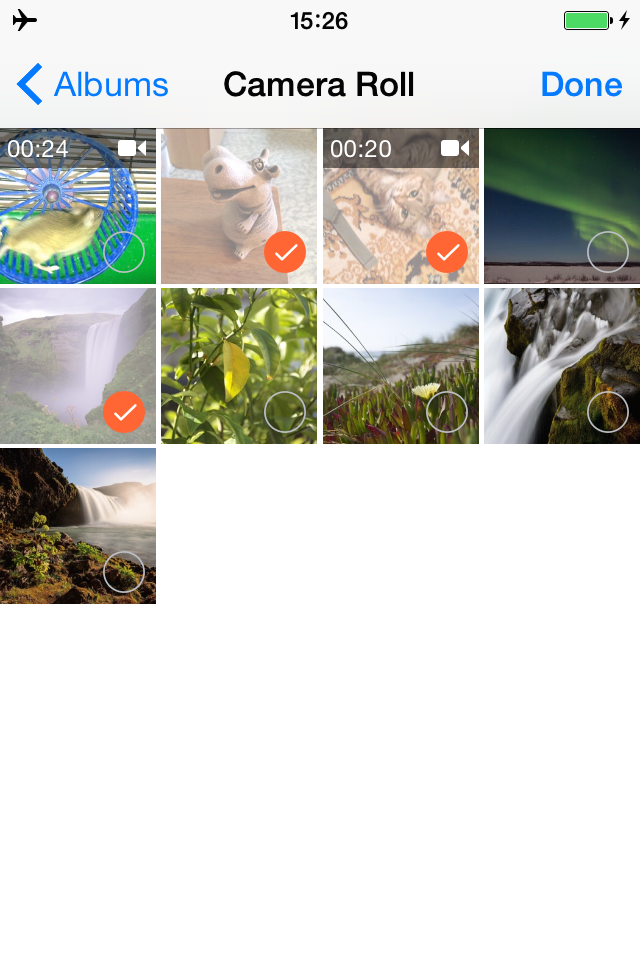

# MAImagePicker
iOS multiple Image Picker

* iOS 5.0 - 8.2 support
* using Photos.framework in iOS 8
* iPhone & iPad support




# How to use
MAImagePicker.xcodeproj is a test demonstration project. To use MAImagePicker in your projects copy source files from folder Source/MAImagePicker/ to your source folder and image files from Res/images/

Open view controller with MAImagePicker:
```objective-c
MAPickerController* vc = [[MAPickerController alloc] initWithDelegate: self maxSel: 3];
UINavigationController* nav = [[UINavigationController alloc] initWithRootViewController: vc];
[self presentViewController: nav animated: YES completion: nil];
```

# License
Permission is granted to anyone to use this software for any purpose, including commercial applications

# Contact
Suggestions will be well received

Mail [pigmasha@gmail.com](mailto:pigmasha@gmail.com)
